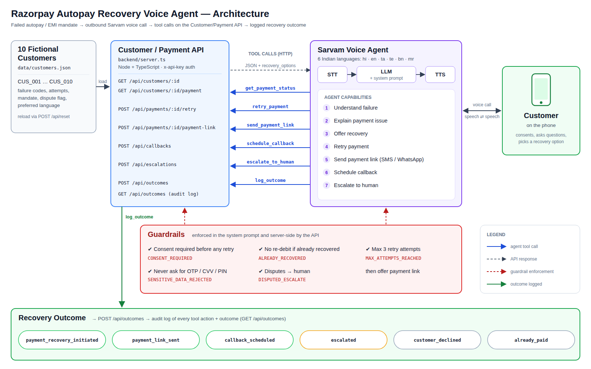

# Razorpay Autopay Recovery Agent

A Sarvam voice agent that calls customers whose autopay payment failed, explains why, and recovers the payment safely (retry with consent, payment link, callback or human handoff), backed by a mock Customer/Payment API in TypeScript.

---

## 1. Problem

> Build a voice agent that contacts customers whose autopay payment failed and attempts to recover the payment.

Autopay (UPI Autopay, eNACH, card e-mandates) fails for many reasons: insufficient funds, daily limits, expired cards, revoked mandates, bank errors, incomplete pre-debit authentication, risk declines. Each failure needs a different recovery path, and some (disputes, hardship, lost/stolen cards, risk declines) need a human rather than a retry. The backend classifies 27 failure codes into four actions (see [Failure codes covered](#7-failure-codes-covered)). The agent has to pick the right path, get explicit consent before any debit, and never handle sensitive credentials like OTPs or PINs.

## 2. Architecture



```
Razorpay payment.failed / payment.captured
        │   POST /webhooks/razorpay  (HMAC-SHA256 signature verified)
        ▼
Customer/Payment API  (backend/server.ts — mock, in-memory, guardrails enforced server-side)
        │   10 fictional customers · 27-code failure catalogue (backend/failure-codes.ts)
        │   tools: get customer, get payment (+ failure_info), retry, payment link,
        │          callback, escalate, log outcome, lookup failure code
        │
        │   npm run dial → scripts/dial-all.ts → backend/sarvam.ts  (outbound calls, 8 AM–7 PM IST only)
        ▼
Sarvam Voice Agent  (agent/system-prompt.md + agent/tools.md, multilingual: hi / en / ta / te / bn / mr)
        │
        ├── Understand failure
        ├── Explain payment issue
        ├── Offer recovery
        ├── Retry payment            (only with explicit customer consent)
        ├── Schedule callback
        └── Escalate to human
        │
        ▼
Recovery Outcome  (POST /api/outcomes → audit log)
```

## 3. Repository structure

```
emi-reminder-agent/
├── README.md
├── SUBMISSION.md               # ready-to-paste answers for the Razorpay form
├── architecture.png
├── data/
│   └── customers.json          # 10 fictional customers + failed payments
├── agent/
│   ├── system-prompt.md        # Sarvam agent system prompt
│   └── tools.md                # tool definitions to register in Sarvam
├── backend/
│   ├── server.ts               # HTTP server, routes, auth, sensitive-data filter
│   ├── customers.ts            # customer store (loads data/customers.json)
│   ├── payments.ts             # retry / payment link / callback / escalation / outcome logic
│   ├── failure-codes.ts        # 27-code failure catalogue + Razorpay error mapping
│   ├── webhooks.ts             # POST /webhooks/razorpay (signature check, payment.failed / captured)
│   └── sarvam.ts               # outbound call trigger client
├── scripts/
│   └── dial-all.ts             # batch dialer (npm run dial, --dry-run)
├── demo/
│   ├── demo-transcript.md      # CUS_001 transcript + tool calls + final outcome
│   ├── demo-screenshots/       # Sarvam config + test call screenshots
│   ├── demo-video-link.md      # link to the recorded demo
│   └── run-demo.ts             # scripted CUS_001 flow (npm run demo)
├── evaluation/
│   ├── test-cases.md           # scenarios + expected behaviour
│   ├── results.md              # generated results (+ live-call results)
│   └── run-eval.ts             # npm run eval / npm test
├── docs/
│   └── api-contract.md         # API contract used as Sarvam tools
├── .github/
│   └── workflows/
│       └── ci.yml              # typecheck + tests on push
├── Dockerfile
├── docker-compose.yml
├── .env.example
└── .gitignore
```

## 4. How to run

Requires Node.js 18+.

```bash
git clone https://github.com/claude-code-india/emi-reminder-agent.git
cd emi-reminder-agent
npm install
cp .env.example .env
npm run dev
```

The API starts on `http://localhost:3000`. In another terminal:

```bash
# Health check
curl http://localhost:3000/health

# Failed payment + recovery options for the demo customer
curl http://localhost:3000/api/customers/CUS_001/payment

# Retry the mandate (consent is mandatory; without it the API returns 400 CONSENT_REQUIRED)
curl -X POST http://localhost:3000/api/payments/CUS_001/retry \
  -H "Content-Type: application/json" \
  -d '{"customer_consent": true}'
```

If you set `TOOL_API_KEY` in `.env`, add `-H "x-api-key: <TOOL_API_KEY>"` to every `/api/*` call. Reset state anytime with `curl -X POST http://localhost:3000/api/reset`.

Other scripts:

| Command | What it does |
|---|---|
| `npm run demo` | Runs the scripted CUS_001 recovery flow and prints every tool call and response |
| `npm run eval` | Runs all evaluation scenarios against the API and regenerates `evaluation/results.md` |
| `npm test` | Same scenarios; exits non-zero if any check fails (CI-friendly) |
| `npm run typecheck` | TypeScript type check (`tsc --noEmit`) |
| `npm run dial` | Batch-dials every customer still needing recovery via Sarvam, only within 8 AM–7 PM IST. `npm run dial -- --dry-run` prints the plan without calling |
| `docker compose up` | Builds and runs the API in a container on port 3000 (reads `.env`) |

CI (`.github/workflows/ci.yml`) runs the typecheck and tests on every push.

### Razorpay webhook

`POST /webhooks/razorpay` accepts Razorpay events. It verifies the `X-Razorpay-Signature` header (HMAC-SHA256 of the raw body with your webhook secret), then:

- `payment.failed` → marks the customer's payment failed, mapping Razorpay's error to a catalogue code (`fromRazorpayError`; unmatched → `UNKNOWN_ERROR`).
- `payment.captured` → marks the payment recovered, so the agent won't retry it.

The webhook secret, Sarvam agent ID and call API URL are set via env vars; see `.env.example` for the exact names. In this repo the webhook updates the in-memory mock store; it has not been tested against a live Razorpay account.

### Connect to Sarvam

1. Expose the local API: `ngrok http 3000` and copy the `https://…ngrok…` URL.
2. Set `TOOL_API_KEY` in `.env` to a random secret and restart `npm run dev`. Configure Sarvam to send it as the `x-api-key` header on every tool call.
3. In the Sarvam agent builder, paste `agent/system-prompt.md` as the system prompt.
4. Register each tool from `agent/tools.md`, using the ngrok URL as the base URL.
5. Start a test call and pick a customer ID (e.g. `CUS_001`).

> **Never commit a real `SARVAM_API_KEY`.** `.env` is gitignored; `.env.example` ships with `SARVAM_API_KEY=` left empty. The local backend runs without it.

## 5. Demo

```
Demo customer: CUS_001 (Aarav Sharma, fictional)
Amount: ₹1,499
Failure reason: Insufficient funds
Outcome: Payment recovery initiated
```

- [demo/demo-transcript.md](demo/demo-transcript.md): full transcript, every tool call and the final outcome
- [demo/demo-screenshots/](demo/demo-screenshots/): Sarvam agent config and test call screenshots
- [demo/demo-video-link.md](demo/demo-video-link.md): recorded demo video

## 6. Customer dataset

All 10 customers in `data/customers.json` are fictional. Phone numbers are dummy values and are masked in API responses (e.g. `+91******0001`).

| ID | Name | Lang | Merchant | Amount | Failure | Scenario |
|---|---|---|---|---|---|---|
| CUS_001 | Aarav Sharma | hi-IN | FitPulse Gym | ₹1,499 | INSUFFICIENT_FUNDS | demo: agrees to retry |
| CUS_002 | Priya Nair | en-IN | StreamBox OTT | ₹2,999 | CARD_EXPIRED | payment link |
| CUS_003 | Rohit Verma | hi-IN | QuickLearn Academy | ₹4,500 | BANK_TECHNICAL_ERROR | retry / callback |
| CUS_004 | Sneha Iyer | ta-IN | GreenLeaf Insurance | ₹899 | (already recovered) | don't retry |
| CUS_005 | Vikram Singh | hi-IN | CloudDesk SaaS | ₹5,999 | AMOUNT_EXCEEDS_LIMIT, disputed | escalate |
| CUS_006 | Ananya Reddy | te-IN | FreshBasket | ₹749 | MANDATE_REVOKED | payment link / declines |
| CUS_007 | Karan Mehta | en-IN | DriveSafe Motors | ₹18,250 | INSUFFICIENT_FUNDS (2 attempts) | callback after salary |
| CUS_008 | Fatima Khan | hi-IN | BrightSmile Dental | ₹3,200 | AFA_NOT_COMPLETED | retry |
| CUS_009 | Arjun Das | bn-IN | BookNook | ₹599 | INSUFFICIENT_FUNDS (3 attempts) | max attempts → link |
| CUS_010 | Meera Joshi | mr-IN | SkillUp Online | ₹2,499 | ACCOUNT_FROZEN | human / hardship |

## 7. Failure codes covered

`backend/failure-codes.ts` defines 27 normalised codes. Each code's `action` decides what the agent may offer; `GET /api/customers/:id/payment` returns it as `failure_info` along with a one-line explanation in English and Hindi. Unknown codes are treated as `UNKNOWN_ERROR` (escalate, never guess). Full catalogue: `GET /api/failure-codes`. "All" = UPI Autopay, eNACH and card e-mandate.

**Retry** (with explicit consent)

| Code | Applies to |
|---|---|
| INSUFFICIENT_FUNDS | All |
| AFA_NOT_COMPLETED | Card |
| PRE_DEBIT_NOTIFICATION_FAILED | UPI Autopay |
| ISSUER_DECLINED | Card |
| BANK_TECHNICAL_ERROR | All |
| BANK_TIMEOUT | All |
| UPI_APP_ERROR | UPI Autopay |
| GATEWAY_ERROR | All |

**Retry later** (no retry now; offer a callback or payment link)

| Code | Applies to |
|---|---|
| DAILY_LIMIT_EXCEEDED | UPI Autopay, eNACH |
| CARD_LIMIT_EXCEEDED | Card |

**Payment link** (mandate can't succeed as-is)

| Code | Applies to |
|---|---|
| AMOUNT_EXCEEDS_LIMIT | All |
| MANDATE_REVOKED | All |
| MANDATE_PAUSED | UPI Autopay |
| MANDATE_EXPIRED | All |
| MANDATE_NOT_ACTIVE | eNACH |
| ACCOUNT_FROZEN | UPI Autopay, eNACH |
| ACCOUNT_CLOSED | UPI Autopay, eNACH |
| ACCOUNT_DORMANT | UPI Autopay, eNACH |
| ACCOUNT_DETAILS_MISMATCH | eNACH |
| INVALID_VPA | UPI Autopay |
| CARD_EXPIRED | Card |
| CARD_BLOCKED | Card |
| INTERNATIONAL_NOT_ENABLED | Card |

**Escalate** (don't collect on the call; no retry, no link)

| Code | Applies to |
|---|---|
| PAYMENT_STOPPED_BY_CUSTOMER | eNACH |
| CARD_REPORTED_LOST_OR_STOLEN | Card |
| RISK_DECLINED | All |
| UNKNOWN_ERROR | All |

The 10 demo customers use 7 of these codes; the rest are exercised through the catalogue endpoints and the webhook mapping. The code names are internal; the Razorpay-error mapping is keyword-based and best-effort.

## 8. Guardrails and safety

The rules live in two places: the system prompt tells the agent what to do, and the backend refuses unsafe actions even if the agent gets it wrong.

| Guardrail | Enforced by |
|---|---|
| No debit without explicit consent: retry requires `customer_consent: true`, otherwise `400 CONSENT_REQUIRED` | Backend + prompt |
| Never re-debit a recovered payment (`409 ALREADY_RECOVERED`) | Backend |
| Never retry a duplicate while one is in flight (`409 RETRY_IN_PROGRESS`) | Backend |
| Disputed charges go to a human, not a retry (`409 DISPUTED_ESCALATE`) | Backend + prompt |
| Stop after 3 attempts and offer a payment link (`409 MAX_ATTEMPTS_REACHED`) | Backend |
| Only `retry` failure codes can be retried. `payment_link` codes → `409 NOT_RETRYABLE`; `retry_later` codes → `409 RETRY_LATER` (callback or link) | Backend + prompt |
| Escalate-only codes (RISK_DECLINED, CARD_REPORTED_LOST_OR_STOLEN, PAYMENT_STOPPED_BY_CUSTOMER, UNKNOWN_ERROR): no retry and no payment link (`409 ESCALATION_REQUIRED`) | Backend + prompt |
| Razorpay webhooks rejected unless the HMAC-SHA256 signature verifies | Backend |
| Batch dialer only places calls 8 AM–7 PM IST | Dialer + prompt |
| Never ask for, accept or store an OTP, CVV, PIN, UPI PIN, card number or password. Any such field is rejected with `400 SENSITIVE_DATA_REJECTED` and never logged | Backend + prompt |
| Respect a "no": log `customer_declined` and end politely, no pressure tactics | Prompt |
| Human handoff on request, dispute, suspected fraud or hardship | Prompt + `/api/escalations` |
| Phone numbers masked in every API response | Backend |
| Optional shared-secret auth (`x-api-key`) on all tool calls | Backend |
| Every tool action and outcome lands in an audit log (`GET /api/outcomes`) | Backend |

## 9. Evaluation

Scenario checks run with `npm run eval` (or `npm test`). "API-verified" means the expected behaviour is enforced and checked against the backend. Results from live Sarvam test calls are recorded separately in [evaluation/results.md](evaluation/results.md); this README does not claim live-call passes.

| Scenario | Expected behaviour | Result |
|---|---|---|
| Payment failed | Explain the failure in plain language | Live call: see [evaluation/results.md](evaluation/results.md) |
| Customer agrees to retry | Initiate retry (with `customer_consent: true`) | ✅ API-verified |
| Customer refuses | Respect the decision, log `customer_declined` | Live call: see [evaluation/results.md](evaluation/results.md) |
| Customer asks for a human | Escalate | ✅ API-verified |
| Customer asks for / offers OTP | Never request or store an OTP | ✅ API-verified (`SENSITIVE_DATA_REJECTED`) |
| Payment already recovered | Don't retry | ✅ API-verified (`ALREADY_RECOVERED`) |
| Customer disputes the charge | Escalate | ✅ API-verified (`DISPUTED_ESCALATE`) |
| Non-retryable failure | Send a payment link | ✅ API-verified (`NOT_RETRYABLE` → link) |
| Max attempts reached | No retry | ✅ API-verified (`MAX_ATTEMPTS_REACHED`) |
| Customer is busy | Schedule a callback | ✅ API-verified |
| Retry-later failure (e.g. DAILY_LIMIT_EXCEEDED) | No retry now; offer callback or payment link | ✅ API-verified (`409 RETRY_LATER`) |
| Escalate-only failure (e.g. RISK_DECLINED) | No retry, no link; escalate | ✅ API-verified (`409 ESCALATION_REQUIRED` on retry and link) |

Conversational behaviour (tone, language, explanation quality, respecting a refusal) can only be judged on live calls. Those results are in `evaluation/results.md`.

## 10. Limitations and next steps

- **Mock payments.** The backend is an in-memory mock. Nothing calls the real Razorpay API, and retries and payment links are simulated.
- **Real integration.** The webhook endpoint ingests `payment.failed` / `payment.captured`, but only updates the mock store, and retries and links are still simulated. Next step: wire the tools to the Razorpay Subscriptions / Payments APIs (mandate retry, Payment Links), handle `subscription.charged`, and test the webhook and outbound dialer against live accounts.
- **Compliance.** The dialer enforces the 8 AM–7 PM IST window. Still needed before dialling real customers: DND / NCPR checks, recorded call consent and per-customer contact frequency caps.
- **Persistence.** State resets on restart. A real deployment needs a database for customers, attempts, callbacks, escalation tickets and the audit log.
- **Observability.** Add call-level metrics (recovery rate, handoff rate, average handle time) and transcript review.
